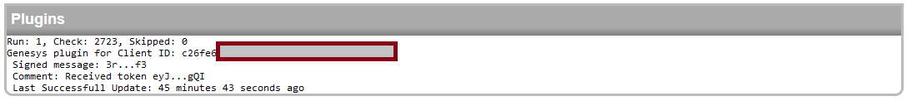

# Setting up GenesysGo node

Setting up GenesysGo is divided into 2 easy steps. First you need to setup authentication, then you can add your node to the pool.

## Authentication
GenesysGo authentication is using our plugin system, so every config attribute related to it is using lowercase. Configuration is places in conf.json.
- client_id should be your GenesysGo client id, be aware that it's displayed on the dashboard so please ensure it's not accessible to the public
- pk is your solana account's private key, for **Phantom Wallet** you can export it by clicking top-left icon, then `security and privacy`->`export private key`

<code>
... ,"plugin-genesys": {"client_id":"c26fe6*","pk": "4rZGkEjJ8qcF*"}, ...
</code>

After placing your data in conf.json you need to start solproxy. If everything's right you should see following message, which will contain updated configuration you should use for production, to not store your private key.

<pre>
Warning: You should copy genesys plugin config from below for production, to not store unencrypted PK
------------------------------------------------------------------
{"client_id":"c26fe6*","msg":"3rYuxoyygKo*",
"public_key":"2PQuSo*"}
------------------------------------------------------------------
</pre>

Notes:
- Private key allows anyone to access your funds, so you should enter your configuration **only locally**, then on production you should use the configuration settings generated by solproxy.
- For additional security never use your main wallet, always create a new, empty one

  

## Adding node
After you have authentication running you should be able to add your genesys node normally. Authentication settings will be matched to GenesysGo node by your client_id
