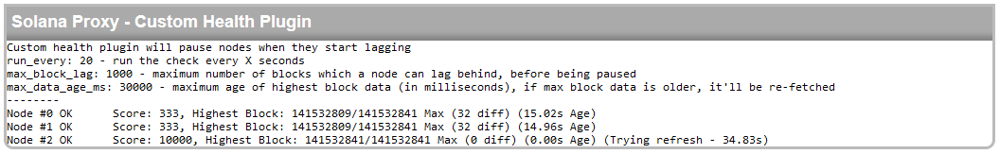

# Healtch check plugin
Healtch check is there so solproxy can automatically pause lagging nodes, using data which solproxy collects as heartbeat process.

<code>
 ... "CUSTOM_HEALTH_CHECKER":{"run_every": 20, "max_block_lag": 1000, "max_data_age_ms": 30000} ...
</code>

The process will run every **run_every seconds** and compare latest-block-number of all defined clients. If latest-block-number was acquired too long ago (> **max_data_age_ms**) the proxy will try to refresh it before doing comparison. Maximum latest-block-number from the cluster is determined, and lastly if any node's lag is greater than **max_block_lag** it'll be paused.

Paused node will be displaying in gray on the dashboard and no user requests will be forwarded to that node, untill it'll catch up with the rest of the network.

  

As you can see on the picture, latest-block-number data was too old for node #3 (>30s), so it was re-fetched. It's good to run these checks infrequently and set proper margins, to conserve requests.

You can configure solana public nodes as sources of latest-block-number data by using priority, so user requests won't be sent to them.